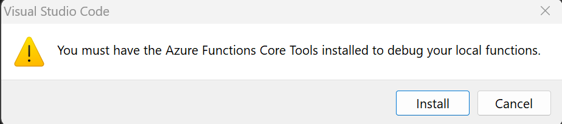

+++
title = "Lab 1: 实验开发环境安装"
weight = 10
+++

## 1. 实验环境概览
本次实验课程为动手开发系列，因此需要建立完整的开发环境用于完成整个Azure IoT解决方案的开发，为简化开发环境的配置，我们尽量选择跨平台和支持插件的开发工具和环境，主要包括：
* **开发PC**：可以使用您的本地机器或者在Azure上的虚拟机，课程将以Azure虚拟机为例说明。
* **操作系统**：本次实验所用到的开发工具和依赖库均支持跨平台开发，因此您可以使用Windows, Linux或Mac OS来完成本次实验过程。本节作为开发环境安装说明，将以Windows环境为例说明实验所需要的开发工具和依赖库的安装，其他操作系统环境下的安装请参照文末所附文档进行安装。

* **开发工具**：Visual Studio Code和Azure CLI将作为本次实验的主要开发工具，二者均支持用于完成本次实验的一系列扩展工具。
* **开发语言**：本次课程的实验项目主要包括边缘端设备应用和服务端应用开发，采用的开发语言包括：
    * 边缘端设备应用： Python 3.8或以上。
    * 服务端应用：Java，基于JDK 11和Spring Boot。
    * 前端应用：Javascript。
## 2. 开发工具
* Maven & JDK 11 or 17
    下载Maven，右键解压，将解压目录apache-maven-3.8.6拷贝到C:\Program Files目录下，并将bin文件夹路径添加到PATH环境变量（win + R, 输入sysdm.cpl）
    下载安装[JDK](https://github.com/adoptium/temurin17-binaries/releases/download/jdk-17.0.5%2B8/OpenJDK17U-jdk_x64_windows_hotspot_17.0.5_8.msi)，安装时注意需要选上"Set JAVA_HOME variable"。  
      
    (可能不能用国内镜像，因为Azure functions有的包国内镜像没有) 配置Maven国内镜像：修改apache-maven-3.8.6\conf\settings.xml，在mirrors标签中添加以下内容：  
    ```xml
    <mirror>
        <id>maven-aliyun-mirror</id>
        <mirrorOf>*</mirrorOf>
        <name>maven-aliyun-mirror</name>
        <url>https://maven.aliyun.com/repository/public</url>
    </mirror>
    ```
    [Link](https://developer.aliyun.com/article/1076262)
* 安装Visual Studio Code
* 安装Visual Studio Code 扩展  
    在VSCode中同时按下Ctrl+Shift+`打开VSCode的终端窗口，执行以下命令安装Java及Python开发所需的扩展：  
    ```bash
    code --install-extension vscjava.vscode-java-pack
    code --install-extension ms-azuretools.vscode-azurefunctions
    ```

    重启VSCode
* Azure Functions Core Tools  (Azure Functions本地调试需要)   
    [安装包链接](https://go.microsoft.com/fwlink/?linkid=2174087)
    或不安装，直接F5调式，vscode也会自动提示安装，点安装它会通过npm安装"npm install -g azure-functions-core-tools@4"  
    

## 3. 创建项目
### 3.1 Azure Functions for Java
1. 执行以下命令创建Azure Functions for Java项目  

    ```bash
    mvn archetype:generate -DarchetypeGroupId="com.microsoft.azure" -DarchetypeArtifactId="azure-functions-archetype" -DarchetypeVersion="LATEST" -DjavaVersion="11" -DgroupId="com.aziot" -DartifactId="az-func-test" -Dversion="1.0-SNAPSHOT" -Dpackage="com.aziot" -DappName="az-func-test"
    ```
    输入**Y**确认。项目创建完成后，执行以下命令在VSCode中打开项目：
    ```bash
    cd az-func-test
    code .
    ```

    在VSCode中按下**Ctrl+Shift+P**打开命令面板，输入`Azure Functions: Initialize`，选择并执行`Azure Functions: Initialize Project for Use with VS Code...`命令：  

      

2. 运行项目  
    在VSCode的终端中执行以下命令构建并运行项目 
    ```bash
    mvn clean package -DskipTests=true
    mvn azure-functions:run
    ```

    或直接按下**F5**进行调试
    [参考Link](https://learn.microsoft.com/en-us/azure/azure-functions/create-first-function-cli-java?tabs=cmd%2Cazure-cli%2Cbrowser)
